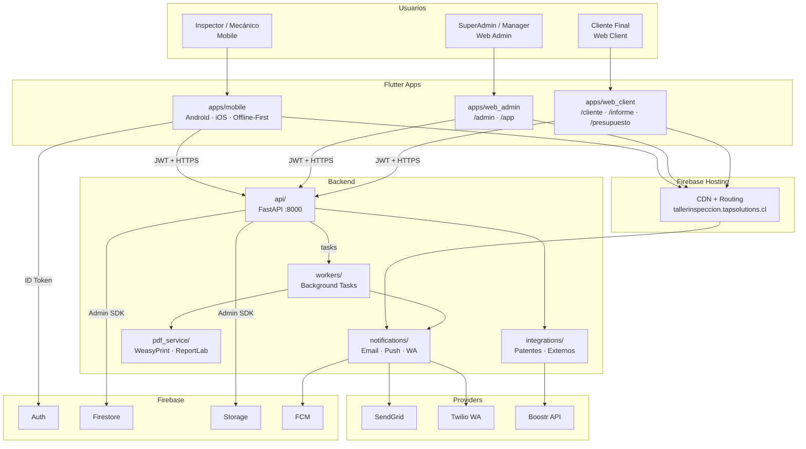
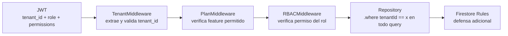
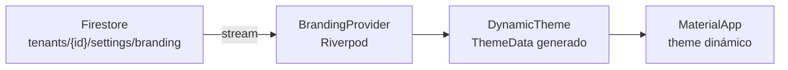
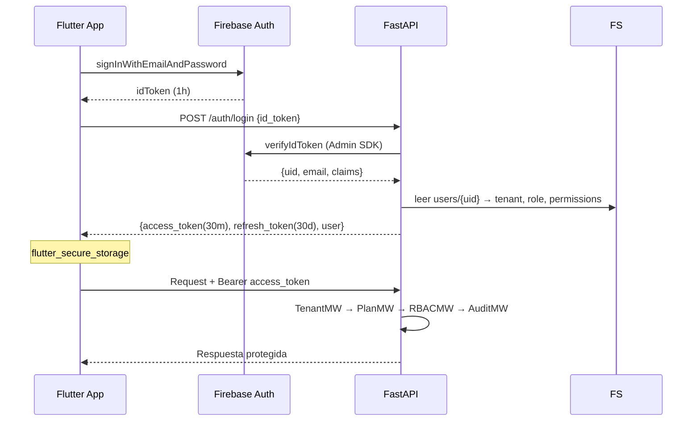

# Arquitectura del Sistema — v2.0 (SaaS Producción)

> **VERSIÓN 2.0** — Reemplaza v1.0. Fuente oficial de arquitectura para la plataforma comercial completa.
> Antes de modificar este documento, leer [HANDOFF.md](HANDOFF.md).

---

## Problemas Detectados en v1.0 y Soluciones

| Problema | Impacto | Solución v2.0 |
|---|---|---|
| Backend monolítico sin separación | PDF bloquea la API | 5 servicios backend especializados |
| Una sola app Flutter | UX y bundle size inapropiados por perfil | 3 apps Flutter separadas |
| Sin RBAC real | Sin control granular de acceso | RBAC completo: roles + permisos independientes |
| Sin offline | Inspecciones fallan sin internet | Offline-first: Drift/SQLite + sync queue |
| Sin auditoría | Incumplimiento regulatorio | Middleware de auditoría inmutable en todas las mutations |
| Sin restricciones de plan | Cualquier tenant usa todos los features | Middleware de plan por endpoint |
| Tokens públicos con ID plano | Enumeración de documentos privados | Tokens HMAC-SHA256 firmados + revocables |
| Modelo Firestore simplificado | No soporta 30+ módulos ni 150+ puntos de inspección | 30+ colecciones con índices compuestos por tenantId |
| Sin paquetes compartidos | Duplicación de modelos entre apps | Monorepo con packages/ Dart/Flutter compartidos |

---

## Principios de Diseño

1. **Clean Architecture** — dependencias apuntan al dominio, nunca hacia afuera
2. **Domain Driven Design** — el negocio define las abstracciones
3. **Feature First + Vertical Slice** — cada módulo contiene todas sus capas
4. **CQRS Preparado** — Commands y Queries separados en application/
5. **Offline First** — la inspección funciona siempre, con o sin internet
6. **Security by Design** — cada capa valida de forma independiente
7. **Multi-tenant by Default** — `tenantId` validado en todo, sin excepciones
8. **Audit Everything** — cada mutación escribe en audit_logs, son inmutables
9. **AI Ready** — interfaces definidas, implementación diferida a Fase IA
10. **Zero Breaking Changes** — API versionada, Firestore sin migraciones destructivas

---

## Diagrama de Sistema



---

## Backend — Servicios

### api/ — FastAPI Principal

Responsabilidades únicas:
- Autenticar y autorizar requests (JWT + RBAC)
- Validar pertenencia al tenant (TenantMiddleware)
- Validar restricciones del plan (PlanMiddleware)
- Registrar audit_log en toda mutación (AuditMiddleware)
- Delegar tareas pesadas a workers/

**Módulos internos (Vertical Slice por bounded context):**

| Módulo | Endpoints | Fase |
|---|---|---|
| `identity` | /auth, /users, /roles, /permissions | 3–4 |
| `tenant` | /tenants, /settings, /branding | 3 |
| `vehicle` | /vehicles, /plate-lookup | 3 |
| `client` | /clients | 3 |
| `inspection` | /inspections, /templates | 3, 8 |
| `document` | /reports, /qr, /public-tokens | 9, 10 |
| `commercial` | /estimates, /work-orders | 11, 12 |
| `calendar` | /calendar | 13 |
| `communication` | /notifications | 15 |
| `analytics` | /dashboard, /analytics | 14 |
| `audit` | /audit-logs | 16 |
| `billing` | /subscriptions, /plans, /api-keys, /webhooks | 3 |
| `storage` | /storage | 3 |

### workers/ — Tareas Asíncronas

Procesos que NO pueden bloquear la API:
- Generación de PDFs (WeasyPrint puede tardar 3-8s)
- Envío de emails con attachments
- Envío de WhatsApp con media
- Cálculo de métricas de analytics
- Limpieza de tokens y refresh_tokens expirados
- Re-sincronización de contadores denormalizados

### notifications/ — Dispatcher Multicanal

- Email → SMTP o SendGrid (configurable por tenant)
- Push → Firebase Cloud Messaging
- WhatsApp → Twilio o WhatsApp Business API (configurable por plan)
- Templates por tenant (branding, idioma)
- Reintentos automáticos con backoff exponencial

### pdf_service/ — Motor PDF

- WeasyPrint como motor primario (HTML/CSS → PDF)
- Templates HTML con variables Jinja2 por tipo de documento
- Branding inyectado dinámicamente (logo, colores, tipografía)
- ReportLab como fallback para elementos gráficos complejos
- Output directo a Firebase Storage

### integrations/ — Adaptadores Externos

- Boostr Plate API (autocompletar datos del vehículo)
- Estructura preparada para: pasarelas de pago, ERP de talleres

---

## Flutter — Aplicaciones

### apps/mobile/ — Campo (Offline-First)

**Usuarios:** Inspector, Mecánico, Recepcionista en campo
**Plataforma:** Android + iOS + PWA

Arquitectura local crítica:
```
Drift (SQLite) ← fuente de verdad local
     ↓ SyncManager ↑
Firestore / API ← fuente de verdad remota
```

Flujo offline:
1. Operación → escribe en SQLite local + agrega a sync_queue
2. UI reactiva inmediata desde SQLite
3. Background: detecta conectividad → drena sync_queue → resuelve conflictos

### apps/web_admin/ — Panel Administración

**Usuarios:** SuperAdmin (plataforma) en `/admin`, TenantAdmin/Manager en `/app`
**Plataforma:** Flutter Web (Responsive: desktop + tablet)

Diferencia de shell por URL:
- `/admin` → shell SuperAdmin (gestión global de tenants, planes, métricas)
- `/app` → shell del Taller (dashboard, inspecciones, usuarios, clientes, CRM)

### apps/web_client/ — Portal Público

**Usuarios:** Clientes finales del taller
**Plataforma:** Flutter Web

Rutas:
- `/cliente` → portal autenticado (historial, datos)
- `/informe/{token}` → informe público por token firmado
- `/presupuesto/{token}` → presupuesto público, con acción de aceptar/rechazar

---

## Packages Compartidos

```
packages/
├── domain/            # Pure Dart: entidades, repos interfaces, value objects
├── application/       # Pure Dart: UseCases, Commands, Queries
├── infrastructure/    # Flutter: Firebase, Dio, SecureStorage adapters
├── shared_models/     # Freezed DTOs compartidos entre todas las apps
├── shared_widgets/    # Widgets reutilizables (forms, cards, dialogs)
├── shared_theme/      # AppTheme + DynamicTheme (branding por tenant)
└── shared_utils/      # Validators, extensions, formatters
```

---

## Concerns Transversales

### Multi-tenancy — Triple Capa



### Auditoría Total

Implementado como middleware en FastAPI. Toda request que muta datos escribe:

```
{userId, userEmail, userRole, tenantId, ip, userAgent, requestId,
 action, entityType, entityId, before, after, changes[], severity}
```

Reglas: NUNCA se eliminan. NUNCA se actualizan. Son append-only.

### Branding Dinámico por Tenant



Cada tenant personaliza: `primaryColor`, `secondaryColor`, `logo`, `favicon`, `fontFamily`, templates de email y PDF.

### AI Readiness (Fase Futura)

Preparado, no implementado:
- Campo `ai_suggestions: Map?` en `inspection_items`
- Subcollección `ai_analysis/` en inspections
- Interface `AIAnalysisService` en domain/ (sin impl)
- Feature flag `ai_features` en planes Enterprise

---

## Flujo de Autenticación



---

## Decisiones Técnicas

| Decisión | Alternativa descartada | Motivo |
|---|---|---|
| Firestore (NoSQL) | PostgreSQL | Firebase ecosystem, Auth integrado, offline SDK real |
| Tenant compartido (tenantId field) | Un proyecto Firebase por tenant | Costo operacional prohibitivo a escala |
| WeasyPrint (primario PDF) | ReportLab puro | HTML/CSS templates más mantenibles que código Python |
| Drift/SQLite (offline) | Hive, Isar, SharedPreferences | SQL real = queries complejas offline + migraciones tipadas |
| HMAC-SHA256 (tokens públicos) | UUID en URL | No enumerable, revocable, firmado, con expiración |
| 3 apps Flutter separadas | 1 mega-app | Bundle size, UX diferenciada, deploy y CI independiente |
| Shared Dart packages | Copiar código entre apps | DRY, un solo modelo de dominio, consistencia garantizada |
| Modular monolith backend | Microservicios desde el inicio | Simplicidad operacional; cada servicio es separable cuando escale |
| CQRS preparado, no implementado | Event sourcing desde el inicio | Preparar sin over-engineering; migrar cuando el volumen lo justifique |
| Feature First + Vertical Slice | Layer First | Cada módulo es autónomo; el equipo puede trabajar en paralelo |

---

## Riesgos y Mitigaciones

| Riesgo | Impacto | Mitigación |
|---|---|---|
| Costo Firestore a escala (reads masivos) | Alto | Índices compuestos precisos + caché en servicio layer |
| Complejidad del offline sync | Alto | Sync queue explícita + conflict resolver por tipo de entidad |
| PDF lento bloqueando requests | Medio | workers/ asíncronos + webhook/polling de estado |
| Firestore Rules complejas | Alto | Testing con Firebase Emulator en CI |
| Branding inconsistente entre apps | Medio | shared_theme/ es única fuente de verdad |
| WhatsApp: aprobación de templates | Alto | Templates preaprobados + fallback a email automático |
| SQLite schema migrations en mobile | Medio | Drift maneja migraciones tipadas + tests de migración |
