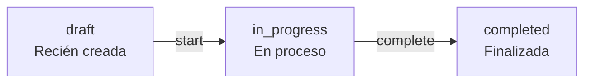
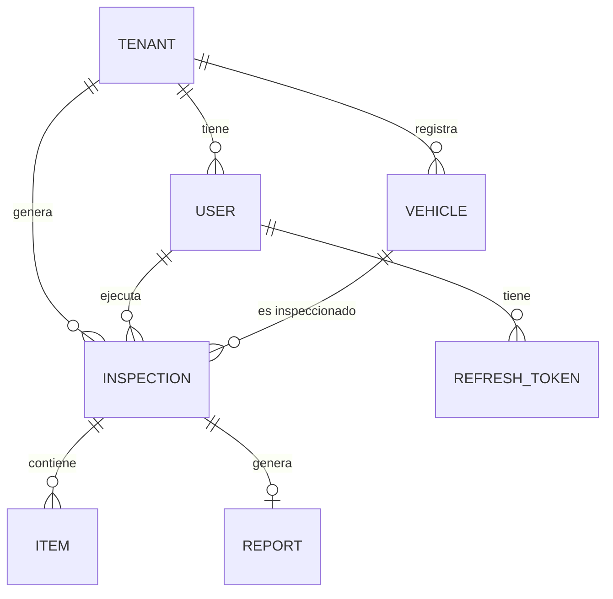

# Modelo de Datos — Firestore

> Fuente oficial del esquema de datos. Ver [ARCHITECTURE.md](ARCHITECTURE.md) para contexto general.

## Principios

- **Multi-tenant**: `tenantId` presente en todos los documentos
- **Auditoría completa**: `createdAt`, `updatedAt`, `createdBy`, `updatedBy` en todos los docs
- **Soft Delete**: documentos críticos nunca se eliminan físicamente
- **Desnormalización controlada**: datos de lectura frecuente duplicados para evitar joins
- **Diseñado para los patrones de acceso**, no para normalización relacional

---

## Campos de auditoría obligatorios

Todos los documentos en Firestore deben incluir estos campos:

```
tenantId:   string      — ID del taller propietario
createdAt:  Timestamp   — momento de creación
updatedAt:  Timestamp   — última modificación
createdBy:  string      — UID Firebase del creador
updatedBy:  string      — UID Firebase del último editor
deletedAt:  Timestamp?  — null = activo, valor = soft deleted
```

---

## Colecciones

### `users`

Un documento por usuario del sistema. `{userId}` = UID de Firebase Auth.

```
users/{userId}
```

| Campo | Tipo | Descripción |
|---|---|---|
| `uid` | string | UID de Firebase Auth (= document ID) |
| `tenantId` | string | ID del taller al que pertenece |
| `email` | string | Email del usuario |
| `displayName` | string | Nombre completo |
| `role` | enum | `owner` · `admin` · `mechanic` |
| `photoUrl` | string? | URL del avatar en Cloud Storage |
| `isActive` | bool | `false` = acceso bloqueado |
| + auditoría | | |

**Roles:**

| Rol | Descripción |
|---|---|
| `owner` | Propietario del taller, acceso total, gestiona facturación |
| `admin` | Gestiona usuarios y configuración del taller |
| `mechanic` | Crea y edita sus propias inspecciones |

---

### `tenants`

Un documento por taller (= una unidad de facturación y aislamiento).

```
tenants/{tenantId}
```

| Campo | Tipo | Descripción |
|---|---|---|
| `name` | string | Nombre del taller |
| `rut` | string | RUT empresarial |
| `address` | string | Dirección física |
| `phone` | string | Teléfono de contacto |
| `email` | string | Email del taller |
| `logoUrl` | string? | URL del logo en Cloud Storage |
| `plan` | enum | `free` · `pro` · `enterprise` |
| `planExpiresAt` | Timestamp? | Vencimiento del plan (null = no expira) |
| `inspectionsThisMonth` | int | Contador mensual para límite del plan |
| `maxInspectionsPerMonth` | int | Límite según plan |
| `isActive` | bool | `false` = taller bloqueado por admin |
| + auditoría | | |

**Límites por plan:**

| Plan | Inspecciones/mes | Usuarios | Precio |
|---|---|---|---|
| `free` | 20 | 2 | Gratis |
| `pro` | Ilimitadas | 10 | Por definir |
| `enterprise` | Ilimitadas | Ilimitados | Por definir |

---

### `vehicles`

Vehículos registrados por un taller.

```
vehicles/{vehicleId}
```

| Campo | Tipo | Descripción |
|---|---|---|
| `tenantId` | string | ID del taller |
| `plate` | string | Patente normalizada (sin guión, mayúsculas: `ABCD12`) |
| `vin` | string? | Número de chasis / VIN |
| `brand` | string | Marca (ej: `Toyota`) |
| `model` | string | Modelo (ej: `Corolla`) |
| `year` | int | Año de fabricación |
| `mileage` | int | Kilometraje al momento de registrar |
| `color` | string? | Color del vehículo |
| `fuelType` | enum? | `gasoline` · `diesel` · `electric` · `hybrid` |
| `clientName` | string? | Nombre del propietario (desnormalizado) |
| `clientEmail` | string? | Email del propietario |
| `clientPhone` | string? | Teléfono del propietario |
| + auditoría | | |

---

### `inspections`

Cada inspección precompra de un vehículo.

```
inspections/{inspectionId}
```

| Campo | Tipo | Descripción |
|---|---|---|
| `tenantId` | string | ID del taller |
| `vehicleId` | string | Referencia al vehículo |
| `mechanicId` | string | UID del mecánico asignado |
| `mechanicName` | string | Nombre del mecánico (desnormalizado) |
| `status` | enum | `draft` · `in_progress` · `completed` |
| `score` | int? | Puntuación final 0–100 (al completar) |
| `totalItems` | int | Total de puntos de inspección |
| `approvedItems` | int | Puntos en estado `approved` |
| `observedItems` | int | Puntos en estado `observed` |
| `rejectedItems` | int | Puntos en estado `rejected` |
| `clientName` | string? | Nombre del cliente que solicita |
| `clientEmail` | string? | Email del cliente |
| `signatureUrl` | string? | URL de la firma digital en Cloud Storage |
| `startedAt` | Timestamp? | Momento en que se inició |
| `completedAt` | Timestamp? | Momento en que se completó |
| + auditoría | | |

**Estados de la inspección:**



---

### `inspections/{inspectionId}/items` (subcolección)

Un documento por punto de inspección dentro de una inspección.

```
inspections/{inspectionId}/items/{itemId}
```

| Campo | Tipo | Descripción |
|---|---|---|
| `tenantId` | string | ID del taller |
| `inspectionId` | string | ID de la inspección padre |
| `category` | string | Categoría del punto (ej: `Motor`, `Frenos`) |
| `name` | string | Nombre del punto (ej: `Nivel de aceite`) |
| `order` | int | Posición en la lista de la categoría |
| `status` | enum | `pending` · `approved` · `observed` · `rejected` |
| `observation` | string? | Texto de observación del mecánico |
| `photos` | string[] | URLs de fotos en Cloud Storage (max 5) |
| + auditoría | | |

---

### `reports`

Reportes PDF generados para inspecciones completadas.

```
reports/{reportId}
```

| Campo | Tipo | Descripción |
|---|---|---|
| `tenantId` | string | ID del taller |
| `inspectionId` | string | ID de la inspección |
| `vehicleId` | string | ID del vehículo |
| `pdfUrl` | string | URL del PDF en Cloud Storage |
| `publicToken` | string | Token para acceso sin login (Fase 6) |
| `publicTokenExpiresAt` | Timestamp | Expiración del link público |
| `sentToEmail` | string? | Email al que se envió |
| `sentAt` | Timestamp? | Momento del envío |
| + auditoría | | |

---

### `refresh_tokens`

Tokens de refresh para validación y rotación.

```
refresh_tokens/{tokenId}
```

| Campo | Tipo | Descripción |
|---|---|---|
| `tenantId` | string | ID del taller |
| `userId` | string | UID del usuario |
| `tokenHash` | string | SHA-256 del token (nunca texto plano) |
| `expiresAt` | Timestamp | Expiración (30 días) |
| `revokedAt` | Timestamp? | Si fue revocado explícitamente |
| `userAgent` | string? | User agent del cliente |
| + auditoría | | |

---

## Diagrama de relaciones



---

## Índices requeridos en Firestore

| Colección | Campos del índice | Uso |
|---|---|---|
| `vehicles` | `tenantId` ASC, `plate` ASC | Buscar por patente |
| `vehicles` | `tenantId` ASC, `deletedAt` ASC, `createdAt` DESC | Listar activos paginados |
| `inspections` | `tenantId` ASC, `status` ASC, `createdAt` DESC | Listar por estado |
| `inspections` | `tenantId` ASC, `vehicleId` ASC, `createdAt` DESC | Historial de vehículo |
| `inspections` | `tenantId` ASC, `mechanicId` ASC, `createdAt` DESC | Inspecciones del mecánico |
| `reports` | `tenantId` ASC, `inspectionId` ASC | Reportes por inspección |
| `refresh_tokens` | `userId` ASC, `expiresAt` ASC | Validar y limpiar tokens |

---

## Soft Delete

Los documentos críticos **nunca se eliminan físicamente**.

Al "eliminar" se setea `deletedAt = Timestamp.now()`.
Todos los queries activos filtran `.where('deletedAt', isNull: true)`.

**Aplica a:** `vehicles`, `inspections`, `items`, `reports`, `tenants`, `users`

**Excepción:** `refresh_tokens` expirados o revocados se limpian en batch job periódico.
