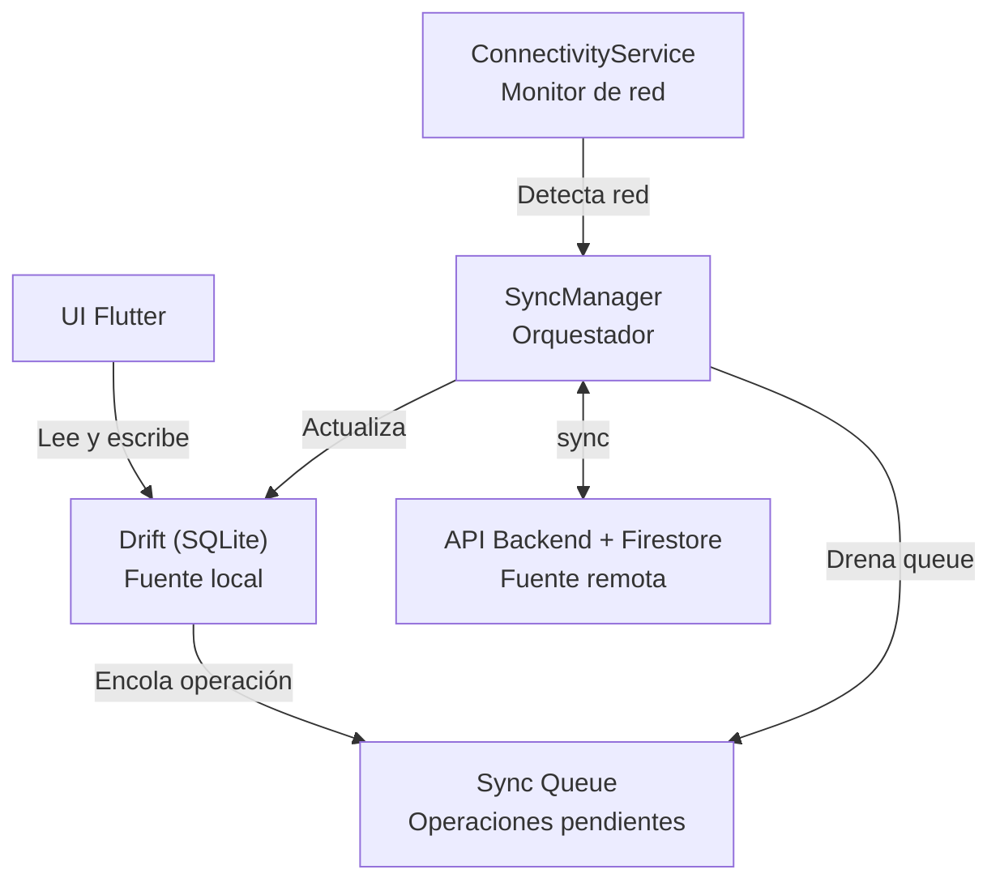
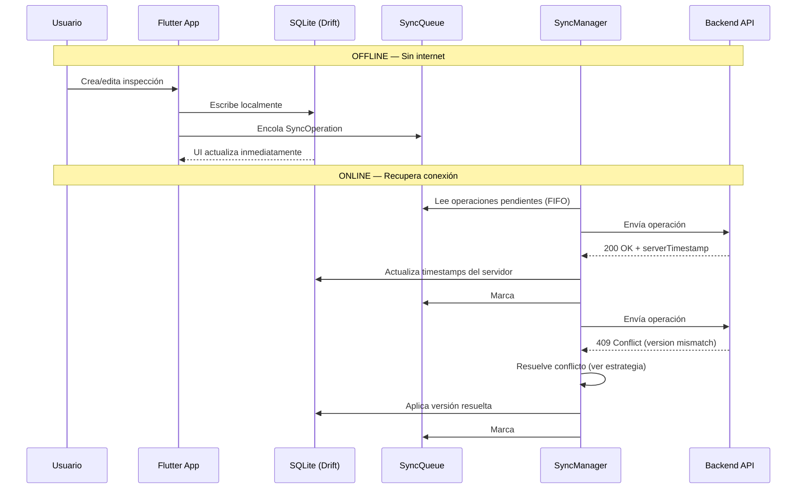
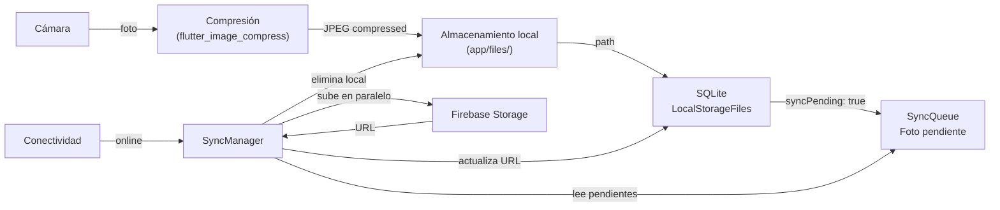

# Offline-First — Estrategia de Sincronización

> Las inspecciones son el core del negocio y DEBEN funcionar sin internet.
> Un taller de mecánica no puede depender de la conectividad durante una inspección.

## Estrategia General

**Fuente de verdad local:** Drift (SQLite) en el dispositivo
**Fuente de verdad remota:** Firestore + API Backend
**Modelo:** Local-first con sync bidireccional



---

## Qué se Sincroniza

| Entidad | Estrategia | Conflicto |
|---|---|---|
| Inspection (header) | Local-first | Servidor gana si `completedAt` != null |
| Inspection items | Local-first | Merge: más reciente gana por item |
| Photos | Upload-only (queue) | No hay conflicto (append) |
| Audio | Upload-only (queue) | No hay conflicto (append) |
| Signature | Upload-only (queue) | No hay conflicto |
| Vehicles | Remote-first (lectura) | Servidor gana |
| Clients | Remote-first (lectura) | Servidor gana |
| Templates | Remote-first (lectura) | Servidor gana |
| Notifications | Remote-only | Solo online |

---

## Drift — Esquema Local (SQLite)

Tablas locales que reflejan el subset necesario para campo:

```dart
// Tablas principales
class LocalInspections extends Table { ... }
class LocalInspectionItems extends Table { ... }
class LocalVehicles extends Table { ... }
class LocalClients extends Table { ... }
class LocalTemplates extends Table { ... }
class LocalStorageFiles extends Table { ... }

// Queue de sincronización
class SyncQueue extends Table {
  // id, operation, entityType, entityId, payload (JSON), retries, status
}

// Conflictos detectados (para resolución manual si se requiere)
class SyncConflicts extends Table {
  // id, entityType, entityId, localVersion, remoteVersion, detectedAt
}
```

---

## Sync Queue — Operaciones Pendientes

Cada operación offline se encola como un registro en `SyncQueue`:

```
SyncOperation {
  id:           UUID local
  operation:    CREATE | UPDATE | DELETE
  entityType:   inspection | inspection_item | photo | audio | signature
  entityId:     string
  payload:      JSON del objeto completo
  localVersion: timestamp local
  retries:      int (máx 5)
  status:       pending | in_flight | completed | failed | conflict
  createdAt:    DateTime
  lastAttemptAt: DateTime?
  errorMessage: string?
}
```

---

## Flujo Offline → Online



---

## Resolución de Conflictos

### Regla General: Servidor Gana para datos críticos

Una inspección `completed` es inmutable desde el servidor. Si el local tiene cambios post-completion:
1. Se descarta el cambio local
2. Se registra en `SyncConflicts` para auditoría
3. Se notifica al usuario (solo si el cambio era significativo)

### Items de Inspección: Merge por campo

Si dos versiones del mismo item difieren:
```
Conflicto detectado cuando: localVersion.updatedAt > remoteVersion.updatedAt
                             Y remote.status != pending (fue editado en otro dispositivo)

Resolución:
1. Si el status local difiere del remoto → gana el más reciente (updatedAt)
2. Si la observación local difiere de la remota → concatenar con separador [OFFLINE] [SYNC]
3. Si photos locales no están en remoto → las locales se agregan (append-only)
```

### Fotos y Audio: Append-only, sin conflicto

Las fotos nunca se sobreescriben. Se suben todas al servidor. Si ya existe la misma foto (por hash del archivo), se ignora el duplicado.

---

## Manejo de Fotos Offline



- Compresión: máx 1200px en el lado más largo, calidad 80%
- Upload: máximo 3 fotos simultáneas (concurrencia controlada)
- Hash SHA-256 para detectar duplicados
- Retención local: hasta que se confirme el upload + 24h

---

## Estado de Sincronización en UI

```
SyncStatus {
  pendingOperations: int
  pendingPhotos:     int
  lastSyncAt:        DateTime?
  hasConflicts:      bool
  isOnline:          bool
  isSyncing:         bool
}
```

Visible en la UI como:
- 🟢 Sincronizado
- 🔵 Sincronizando... (N pendientes)
- 🟠 Sin conexión — N cambios guardados localmente
- 🔴 Conflicto detectado — Revisar

---

## Datos No Disponibles Offline

Los siguientes datos requieren conexión:
- Analytics y dashboard (datos en tiempo real)
- Historial completo de otros mecánicos
- Configuración del tenant (se cachea al login)
- Facturación y suscripción

Si el usuario intenta acceder offline a estos módulos, se muestra el estado cacheado (si existe) con un banner "Datos desde {lastSyncAt}".
