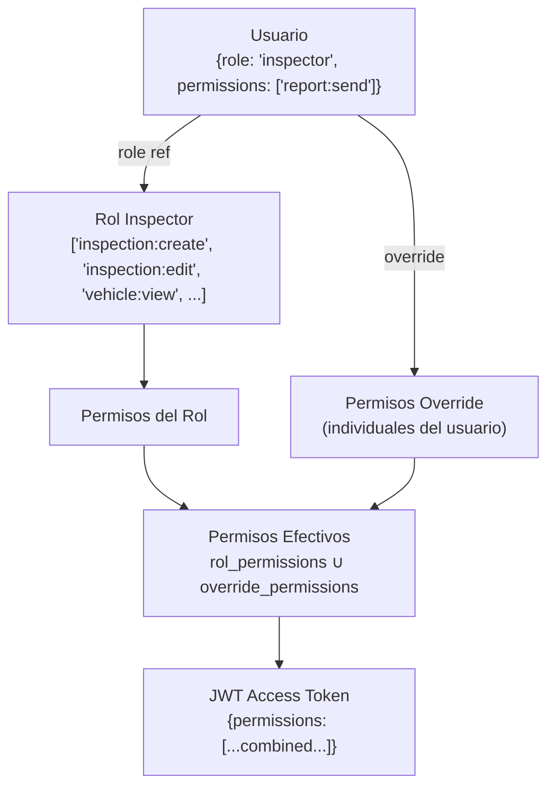

# Sistema RBAC — Roles, Permisos y Control de Acceso

> Fuente oficial del sistema de control de acceso basado en roles.
> Ver [SECURITY.md](SECURITY.md) para el flujo de autenticación completo.

## Diseño

El RBAC de esta plataforma separa **roles** de **permisos**:

- Un **rol** agrupa permisos por defecto (ej: `Inspector` tiene `inspection:create`)
- Los **permisos** son independientes y pueden asignarse individualmente a usuarios
- Un usuario tiene el permiso si su **rol** lo incluye **O** si tiene override individual
- Los permisos se incrustan en el JWT para validación sin consultar Firestore



---

## Roles del Sistema

| Rol | Código | Tenant? | Descripción |
|---|---|---|---|
| Super Admin | `superadmin` | No (global) | Gestión completa de la plataforma SaaS |
| Tenant Admin | `tenant_admin` | Sí | Propietario/dueño del taller |
| Workshop Manager | `workshop_manager` | Sí | Gerente con acceso amplio pero sin billing |
| Inspector | `inspector` | Sí | Realiza inspecciones precompra |
| Mechanic | `mechanic` | Sí | Trabaja en órdenes de trabajo |
| Receptionist | `receptionist` | Sí | Recibe vehículos, agenda, clientes |
| Customer | `customer` | Sí | Cliente del taller (acceso portal) |

### Jerarquía de acceso

```
SuperAdmin
    └── TenantAdmin
            └── WorkshopManager
                    ├── Inspector
                    ├── Mechanic
                    └── Receptionist
                            ↓ (portal separado)
                        Customer
```

---

## Catálogo Completo de Permisos

### Módulo: Identity

| Código | Descripción |
|---|---|
| `user:view` | Ver lista y perfil de usuarios |
| `user:create` | Crear usuarios en el taller |
| `user:edit` | Editar usuarios |
| `user:delete` | Desactivar usuarios |
| `role:view` | Ver roles |
| `role:manage` | Crear y editar roles |
| `permission:view` | Ver permisos disponibles |

### Módulo: Tenant

| Código | Descripción |
|---|---|
| `tenant:view` | Ver datos del taller |
| `tenant:edit` | Editar datos del taller |
| `tenant:branding` | Editar branding del taller |
| `tenant:billing` | Gestionar suscripción y facturación |
| `tenant:api_keys` | Gestionar API keys |
| `tenant:webhooks` | Gestionar webhooks |

### Módulo: Vehicle

| Código | Descripción |
|---|---|
| `vehicle:view` | Ver vehículos |
| `vehicle:create` | Registrar vehículos |
| `vehicle:edit` | Editar vehículos |
| `vehicle:delete` | Soft delete de vehículos |

### Módulo: Client

| Código | Descripción |
|---|---|
| `client:view` | Ver clientes |
| `client:create` | Crear clientes |
| `client:edit` | Editar clientes |
| `client:delete` | Soft delete de clientes |

### Módulo: Inspection

| Código | Descripción |
|---|---|
| `inspection:view` | Ver inspecciones |
| `inspection:view_all` | Ver todas las inspecciones del taller (no solo las propias) |
| `inspection:create` | Crear inspecciones |
| `inspection:edit` | Editar inspecciones en progreso |
| `inspection:complete` | Marcar inspección como completada |
| `inspection:delete` | Soft delete de inspecciones |
| `inspection:review` | Revisar y aprobar inspecciones |
| `inspection:send_report` | Enviar informe al cliente |
| `template:view` | Ver plantillas de inspección |
| `template:manage` | Crear y editar plantillas |

### Módulo: Document

| Código | Descripción |
|---|---|
| `report:view` | Ver reportes generados |
| `report:generate` | Generar PDF de reporte |
| `report:send` | Enviar reporte por email/WhatsApp |
| `report:download` | Descargar PDF |

### Módulo: Commercial

| Código | Descripción |
|---|---|
| `estimate:view` | Ver presupuestos |
| `estimate:create` | Crear presupuestos |
| `estimate:edit` | Editar presupuestos |
| `estimate:delete` | Soft delete |
| `estimate:send` | Enviar presupuesto al cliente |
| `work_order:view` | Ver órdenes de trabajo |
| `work_order:create` | Crear OT |
| `work_order:edit` | Editar OT |
| `work_order:complete` | Completar OT |

### Módulo: Calendar

| Código | Descripción |
|---|---|
| `calendar:view` | Ver agenda |
| `calendar:create` | Crear eventos |
| `calendar:edit` | Editar/cancelar eventos |

### Módulo: Analytics

| Código | Descripción |
|---|---|
| `analytics:view` | Ver dashboard y métricas |
| `analytics:export` | Exportar datos |

### Módulo: Audit

| Código | Descripción |
|---|---|
| `audit:view` | Ver logs de auditoría |

### Módulo: Storage

| Código | Descripción |
|---|---|
| `storage:upload` | Subir archivos |
| `storage:delete` | Eliminar archivos |

---

## Matriz de Permisos por Rol (Defecto)

| Permiso | SuperAdmin | TenantAdmin | Manager | Inspector | Mechanic | Receptionist | Customer |
|---|:---:|:---:|:---:|:---:|:---:|:---:|:---:|
| `user:view` | ✅ | ✅ | ✅ | — | — | — | — |
| `user:create` | ✅ | ✅ | — | — | — | — | — |
| `user:edit` | ✅ | ✅ | — | — | — | — | — |
| `role:manage` | ✅ | ✅ | — | — | — | — | — |
| `tenant:edit` | ✅ | ✅ | — | — | — | — | — |
| `tenant:billing` | ✅ | ✅ | — | — | — | — | — |
| `tenant:branding` | ✅ | ✅ | ✅ | — | — | — | — |
| `vehicle:view` | ✅ | ✅ | ✅ | ✅ | ✅ | ✅ | — |
| `vehicle:create` | ✅ | ✅ | ✅ | ✅ | — | ✅ | — |
| `vehicle:edit` | ✅ | ✅ | ✅ | ✅ | — | ✅ | — |
| `client:view` | ✅ | ✅ | ✅ | ✅ | — | ✅ | — |
| `client:create` | ✅ | ✅ | ✅ | ✅ | — | ✅ | — |
| `inspection:view` | ✅ | ✅ | ✅ | ✅ | — | ✅ | — |
| `inspection:view_all` | ✅ | ✅ | ✅ | — | — | — | — |
| `inspection:create` | ✅ | ✅ | ✅ | ✅ | — | ✅ | — |
| `inspection:edit` | ✅ | ✅ | ✅ | ✅ | — | — | — |
| `inspection:complete` | ✅ | ✅ | ✅ | ✅ | — | — | — |
| `inspection:review` | ✅ | ✅ | ✅ | — | — | — | — |
| `inspection:send_report` | ✅ | ✅ | ✅ | ✅ | — | — | — |
| `estimate:view` | ✅ | ✅ | ✅ | — | — | ✅ | ✅ |
| `estimate:create` | ✅ | ✅ | ✅ | ✅ | — | ✅ | — |
| `work_order:view` | ✅ | ✅ | ✅ | — | ✅ | ✅ | — |
| `work_order:create` | ✅ | ✅ | ✅ | — | — | ✅ | — |
| `calendar:view` | ✅ | ✅ | ✅ | ✅ | ✅ | ✅ | — |
| `analytics:view` | ✅ | ✅ | ✅ | — | — | — | — |
| `audit:view` | ✅ | ✅ | — | — | — | — | — |
| `tenant:api_keys` | ✅ | ✅ | — | — | — | — | — |

---

## Estructura JWT

El access token incluye los permisos efectivos para evitar consultas a Firestore en cada request:

```json
{
  "sub": "firebase_uid",
  "email": "inspector@taller.com",
  "tenant_id": "tenant_abc123",
  "role": "inspector",
  "permissions": [
    "vehicle:view", "vehicle:create",
    "inspection:view", "inspection:create",
    "inspection:edit", "inspection:complete",
    "inspection:send_report", "client:view",
    "report:generate", "report:send",
    "calendar:view", "storage:upload"
  ],
  "plan": "professional",
  "iat": 1751234567,
  "exp": 1751236367
}
```

---

## Implementación en FastAPI

```
Middleware stack (en orden de ejecución):
1. SecurityHeadersMiddleware    → HTTPS, CORS, CSP headers
2. AuthMiddleware               → Verifica JWT, extrae user context
3. TenantMiddleware             → Valida tenant_id, carga branding
4. PlanMiddleware               → Verifica feature habilitado para el plan
5. RBACMiddleware               → Verifica permiso requerido por el endpoint
6. AuditMiddleware              → Post-request: escribe en audit_logs si hubo mutación
```

Cada endpoint declara:
```python
@router.post("/inspections",
    dependencies=[
        Depends(require_permission("inspection:create")),
        Depends(require_plan_feature("inspections")),
    ]
)
```

---

## Implementación en Flutter

El `PermissionChecker` en la capa presentation consulta los permisos del JWT local:

```dart
// En un Provider
if (!permissionChecker.can('inspection:complete')) {
  return const AccessDeniedWidget();
}

// En GoRouter guard
redirect: (context, state) {
  if (!ref.read(permissionProvider).can('analytics:view')) {
    return '/unauthorized';
  }
  return null;
}
```

Los permisos se almacenan en `flutter_secure_storage` junto con el access token. Al renovar el token, los permisos se actualizan automáticamente.
