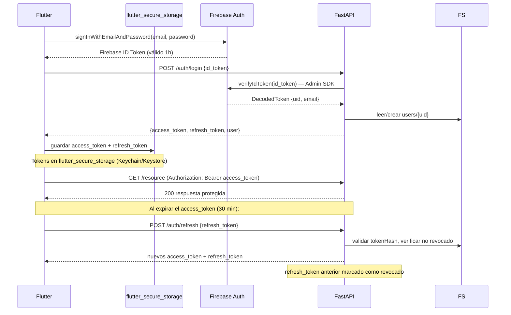
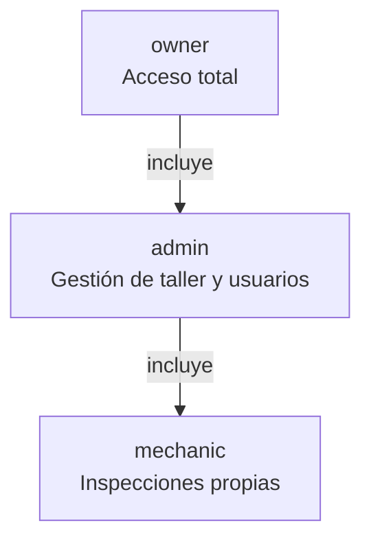

# Seguridad

> Fuente oficial de arquitectura de seguridad. Ver [ARCHITECTURE.md](ARCHITECTURE.md) para contexto general.

## Principios

- Nunca confiar en validaciones del frontend
- Validar todo en el backend (Pydantic + lógica de negocio)
- Principio de mínimo privilegio en roles y Firestore Rules
- Defensa en profundidad: múltiples capas independientes
- Nunca almacenar tokens en texto plano

---

## Autenticación — Flujo completo



---

## Tokens

| Token | Duración | Almacenamiento | Renovación |
|---|---|---|---|
| Firebase ID Token | 1 hora | Memoria (Flutter SDK) | Automática por Firebase SDK |
| Access Token (JWT) | 30 minutos | `flutter_secure_storage` | Via refresh token |
| Refresh Token (JWT) | 30 días | `flutter_secure_storage` + Firestore (hash) | Login nuevo |

### Estructura del Access Token (JWT payload)

```json
{
  "sub": "firebase_uid_string",
  "email": "mecanico@taller.com",
  "tenant_id": "tenant_abc123",
  "role": "mechanic",
  "iat": 1751234567,
  "exp": 1751236367
}
```

### Refresh Token Rotation

1. Al usar un refresh token válido → se genera uno nuevo, el anterior queda `revokedAt`
2. Si se detecta uso de un token ya revocado → revocar **todos** los tokens del usuario
3. El token se guarda en Firestore como `SHA-256(token)`, nunca en texto plano

---

## Autorización — Roles y permisos



| Acción | mechanic | admin | owner |
|---|---|---|---|
| Ver inspecciones propias | ✅ | ✅ | ✅ |
| Ver todas las inspecciones del taller | ❌ | ✅ | ✅ |
| Crear vehículos e inspecciones | ✅ | ✅ | ✅ |
| Editar perfil del taller | ❌ | ✅ | ✅ |
| Invitar usuarios | ❌ | ✅ | ✅ |
| Eliminar usuarios | ❌ | ❌ | ✅ |
| Gestionar facturación | ❌ | ❌ | ✅ |

### Validación en backend

Cada endpoint protegido verifica en orden:
1. JWT válido y no expirado
2. `tenant_id` del JWT coincide con el recurso solicitado
3. `role` del JWT tiene permiso para la operación

---

## Firestore Security Rules

Las reglas son una capa de defensa adicional al backend.
El backend usa el Admin SDK (bypass rules), pero las rules protegen acceso directo desde el cliente.

```javascript
rules_version = '2';
service cloud.firestore {
  match /databases/{database}/documents {

    function isAuthenticated() {
      return request.auth != null;
    }

    function belongsToTenant(tenantId) {
      return request.auth.token.tenantId == tenantId;
    }

    function hasRole(role) {
      return request.auth.token.role == role;
    }

    // Perfil propio del usuario
    match /users/{userId} {
      allow read: if isAuthenticated() && request.auth.uid == userId;
      allow write: if false; // Solo via backend (Admin SDK)
    }

    // Datos del taller
    match /tenants/{tenantId} {
      allow read: if isAuthenticated() && belongsToTenant(tenantId);
      allow write: if false;
    }

    // Vehículos: solo lectura para el taller correspondiente
    match /vehicles/{vehicleId} {
      allow read: if isAuthenticated()
        && belongsToTenant(resource.data.tenantId);
      allow write: if false;
    }

    // Inspecciones
    match /inspections/{inspectionId} {
      allow read: if isAuthenticated()
        && belongsToTenant(resource.data.tenantId);
      allow write: if false;
    }

    // Denegar todo lo demás
    match /{document=**} {
      allow read, write: if false;
    }
  }
}
```

---

## Validación de entrada

| Capa | Herramienta | Qué valida |
|---|---|---|
| Flutter (UX) | Form validators | Formato, campos requeridos (solo UX) |
| Backend — API | Pydantic v2 | Schema del request body y query params |
| Backend — Service | Lógica de negocio | Reglas de negocio (estado, permisos, límites) |
| Backend — Infra | Firestore Rules | Control de acceso adicional |

El frontend nunca es la capa de seguridad. Toda validación crítica ocurre en backend.

---

## Rate Limiting

Implementado en Fase 1 como middleware FastAPI.

| Endpoint | Límite | Ventana | Por |
|---|---|---|---|
| `POST /auth/login` | 10 requests | 15 minutos | IP |
| `POST /auth/refresh` | 20 requests | 15 minutos | IP |
| Endpoints generales | 100 requests | 1 minuto | tenant_id |
| Generación de PDF | 10 requests | 1 hora | tenant_id |

---

## CORS

Solo orígenes en `ALLOWED_ORIGINS` (variable de entorno).

| Entorno | Orígenes permitidos |
|---|---|
| Desarrollo | `localhost:3000`, `localhost:8080` |
| Producción | Solo dominios del frontend en producción |

---

## Gestión de secretos

| Secreto | Almacenamiento | Nunca en |
|---|---|---|
| `JWT_SECRET_KEY` | Variable de entorno | Código fuente |
| Firebase credentials | `firebase_credentials.json` (fuera del repo) | Git |
| API keys de terceros | Variables de entorno | Código fuente |
| Tokens de usuario | `flutter_secure_storage` | SharedPreferences |
| Refresh tokens | Firestore (hash SHA-256) | Texto plano |

`.env` y `firebase_credentials.json` están en `.gitignore`.

---

## Checklist de seguridad por fase

| Fase | Implementación requerida |
|---|---|
| **Fase 1** | JWT + Refresh Token rotation + Firestore Rules básicas + Rate limit en auth |
| **Fase 2** | Validación de `tenantId` en todos los endpoints · Roles en JWT |
| **Fase 4** | Integridad de inspecciones completadas (no editables) |
| **Fase 5** | Tokens de acceso público a reportes con expiración |
| **Fase 8** | Auditoría de acciones de facturación · Webhooks firmados |
| **Fase 9** | Penetration testing · Security headers · CSP · OWASP Top 10 review |
