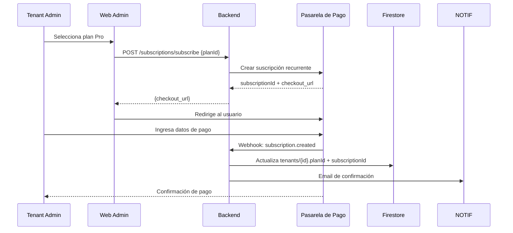

# Planes SaaS y Restricciones

> Fuente oficial del modelo de suscripción. Ver [RBAC.md](RBAC.md) para permisos por rol.

## Planes

| Feature | Basic | Professional | Premium | Enterprise |
|---|:---:|:---:|:---:|:---:|
| **Usuarios** | 2 | 5 | 15 | Ilimitados |
| **Inspecciones/mes** | 20 | 100 | 500 | Ilimitadas |
| **Storage** | 1 GB | 10 GB | 50 GB | Personalizado |
| **Clientes** | 50 | 500 | 5.000 | Ilimitados |
| **Plantillas** | 1 | 5 | 20 | Ilimitadas |
| **Portal cliente** | ❌ | ✅ | ✅ | ✅ |
| **Presupuestos** | ❌ | ✅ | ✅ | ✅ |
| **Órdenes de trabajo** | ❌ | ✅ | ✅ | ✅ |
| **Agenda** | ❌ | ✅ | ✅ | ✅ |
| **Dashboard avanzado** | ❌ | ✅ | ✅ | ✅ |
| **Branding personalizado** | ❌ | ❌ | ✅ | ✅ |
| **Dominio personalizado** | ❌ | ❌ | ✅ | ✅ |
| **WhatsApp** | ❌ | ❌ | ✅ | ✅ |
| **API pública** | ❌ | ❌ | ❌ | ✅ |
| **Webhooks** | ❌ | ❌ | ❌ | ✅ |
| **IA (futura)** | ❌ | ❌ | ❌ | ✅ |
| **Exportar datos** | ❌ | ✅ | ✅ | ✅ |
| **Soporte** | Email | Email | Prioritario | Dedicado |
| **Período de prueba** | 14 días | 14 días | 14 días | 30 días |

---

## Estructura en Firestore (`plans/{planId}`)

```json
{
  "code": "professional",
  "name": "Professional",
  "features": {
    "maxUsers": 5,
    "maxInspectionsPerMonth": 100,
    "maxStorageGB": 10,
    "maxClients": 500,
    "maxTemplates": 5,
    "clientPortal": true,
    "estimates": true,
    "workOrders": true,
    "calendar": true,
    "advancedDashboard": true,
    "customBranding": false,
    "customDomain": false,
    "whatsappIntegration": false,
    "publicApi": false,
    "webhooks": false,
    "aiFeatures": false,
    "dataExport": true,
    "prioritySupport": false
  }
}
```

---

## Enforcement — PlanMiddleware

El `PlanMiddleware` en FastAPI verifica la feature antes de ejecutar el endpoint:

```python
# En cada endpoint que requiere feature del plan:
@router.post("/estimates",
    dependencies=[
        Depends(require_plan_feature("estimates")),
    ]
)
async def create_estimate(...): ...

# Lógica de require_plan_feature:
async def require_plan_feature(feature: str):
    tenant_plan = get_cached_plan_features(tenant_id)
    if not tenant_plan.get(feature, False):
        raise PlanFeatureNotAvailableException(feature)

# Para límites numéricos:
async def check_inspection_limit(tenant: TenantContext):
    if tenant.plan.maxInspectionsPerMonth > 0:
        if tenant.inspectionCountThisMonth >= tenant.plan.maxInspectionsPerMonth:
            raise MonthlyLimitExceededException("inspections")
```

---

## Enforcement en Flutter

El `PlanGuard` en GoRouter bloquea la navegación a features no disponibles:

```dart
// En GoRouter, routes que requieren features del plan:
GoRoute(
  path: '/estimates',
  redirect: (context, state) {
    if (!ref.read(planProvider).hasFeature('estimates')) {
      return '/upgrade?feature=estimates';
    }
    return null;
  },
)

// Widget para mostrar feature bloqueada:
PlanFeatureGate(
  feature: 'whatsappIntegration',
  child: WhatsAppConfigWidget(),
  fallback: UpgradePrompt(feature: 'whatsappIntegration'),
)
```

---

## Contadores Denormalizados

Los contadores críticos se mantienen en `tenants/{tenantId}` para evitar queries costosos en cada request:

| Campo | Cuándo se actualiza |
|---|---|
| `inspectionCountThisMonth` | Al crear una inspección; reset el 1° de cada mes (worker) |
| `activeUserCount` | Al activar/desactivar usuarios |
| `storageUsedBytes` | Al subir/eliminar archivos en Storage |

El reset mensual lo ejecuta un worker programado (cron) el día 1 de cada mes.

---

## Flujo de Suscripción



---

## Manejo de Vencimiento y Degradación

| Estado | Acción |
|---|---|
| `trialing` | Acceso completo al plan seleccionado durante el trial |
| `active` | Acceso normal |
| `past_due` | Acceso limitado (solo lectura 7 días) + notificaciones diarias |
| `cancelled` | Degradar a Basic al final del período pagado |
| `expired` | Solo lectura + exportar datos |

Al degradar de plan:
1. Features no disponibles quedan bloqueadas (no se eliminan datos)
2. Si el usuario creó más entidades que el nuevo límite, puede ver pero no crear más
3. Los datos nunca se eliminan por cambio de plan

---

## Período de Prueba

- 14 días en Basic/Professional/Premium, 30 en Enterprise
- Acceso completo al plan correspondiente
- Sin requerir tarjeta de crédito (configurable)
- Al vencer el trial: degradar a plan gratuito o solicitar pago
- Un solo trial por tenant (validado por RUT + email de dominio)
